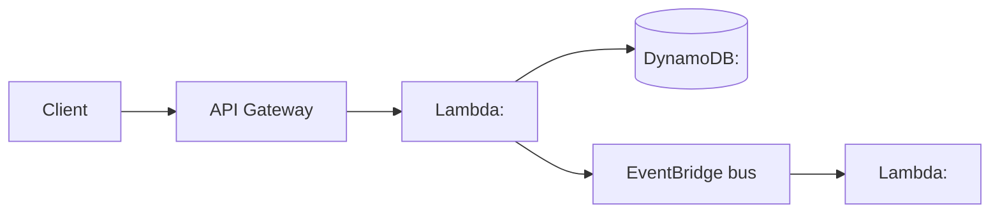
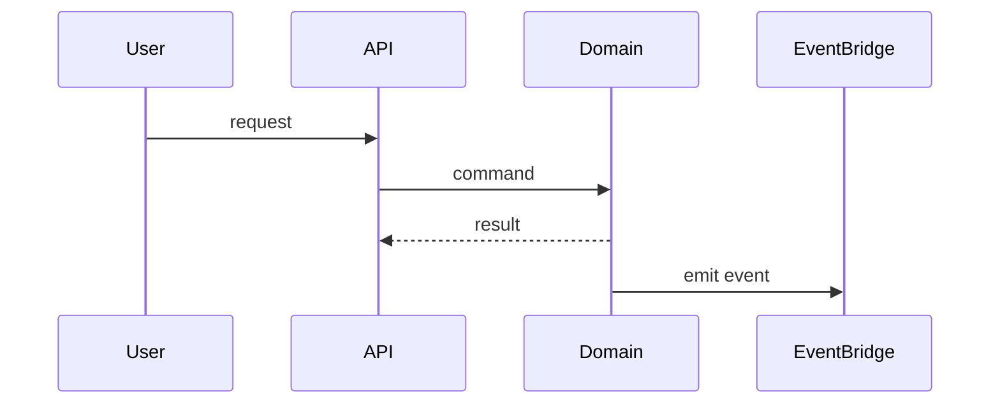

# Logical Design: <Unit>

> Domain Model에 NFR과 architectural pattern을 입혀 구현 청사진을 만든다. AWS service 매핑이 여기서 등장.

## NFR 반영
- 어떤 NFR이 어떤 design choice를 강제했는가:
  - <NFR> → <pattern/service 선택>

## Selected Patterns
- <CQRS / Event-Driven / Saga / Outbox / Circuit Breaker / Retry-with-backoff / Cache-aside ...>
  - 적용 위치:
  - ADR: <ADR-NNNN>

## AWS Service Mapping

| Domain element | AWS service / construct | 사유 (well-architected 관점) |
|---|---|---|
| <Aggregate / Entity / Event> | <Lambda / DynamoDB / EventBridge ...> | <이유> |

## Component Diagram

## Sequence (주요 use case)

## Data Model
- 주요 table / collection / topic:
- partition key / sort key:
- access pattern 정리:

## Security Posture
- IAM 정책 경계:
- network 경계 (VPC, security group):
- secret 관리:

## Observability Plan
- log 필드:
- metric (custom):
- trace span 경계:

## Testing Plan
- functional: <시나리오>
- security (static/dynamic): <도구/시나리오>
- performance / load: <시나리오>

## Open Risks / Trade-offs
- <명시>
